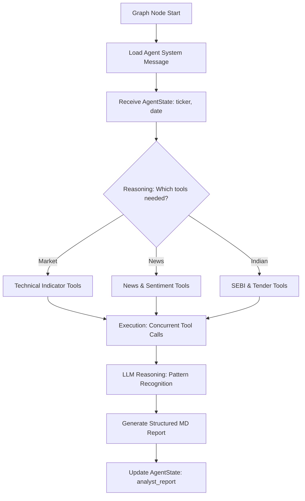
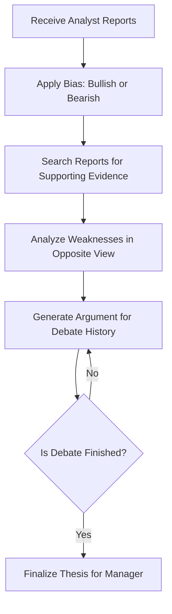
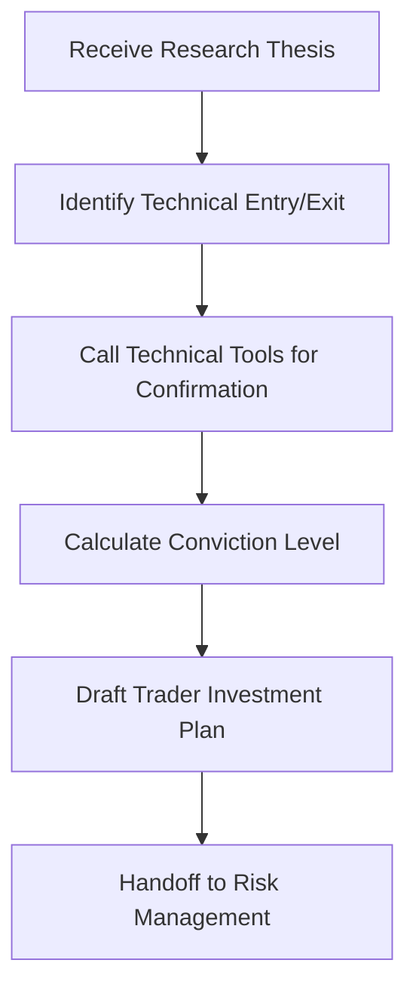
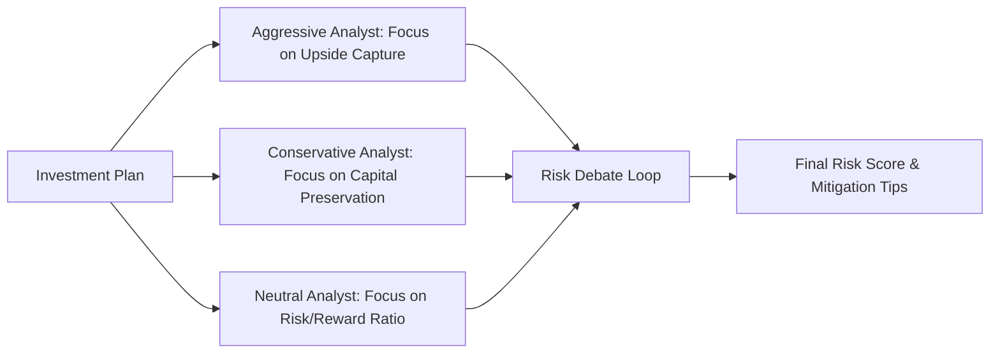
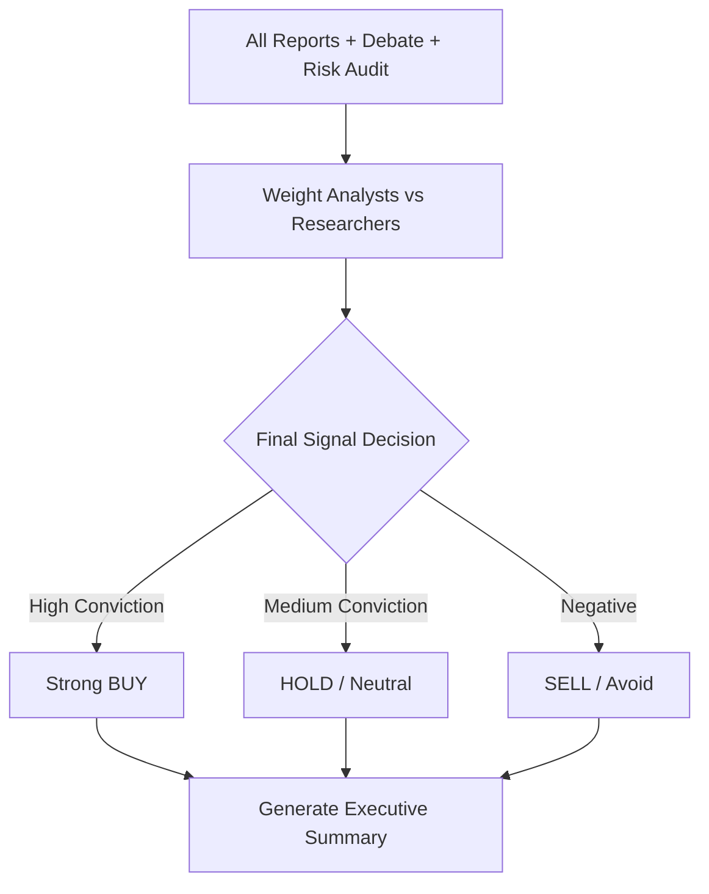

# Low-Level Design (LLD): Agent Internals

This document details the internal logic and operational flow for each agent class within the **Orbis Quant Agents** framework.

---

## 1. Analyst Agents (Intelligence Layer)
*Types: Market, News, Fundamentals, Social, Small-Cap*

### Logic Flow
Analyst agents are "tool-use" specialists. They follow a loop of observing data, reasoning about its relevance, and synthesizing it into a structured markdown report.

---

## 2. Researcher Agents (Debate Layer)
*Types: Bull Researcher, Bear Researcher*

### Logic Flow
Researchers are designed for "adversarial reasoning." They do not just summarize; they actively defend a specific market bias (Long or Short) by selectively weighting evidence.

---

## 3. Trader Agent (Strategy Layer)
*Type: Trader*

### Logic Flow
The Trader acts as the "Architect" of the trade. It takes abstract research and converts it into a concrete technical setup.

---

## 4. Risk Management Team (Audit Layer)
*Types: Aggressive, Conservative, Neutral*

### Logic Flow
Risk agents perform a "scenario-based audit." They look for what could go wrong rather than what could go right.

---

## 5. Portfolio Manager (Decision Layer)
*Type: Portfolio Manager*

### Logic Flow
The PM is the final synthesizer. It uses a "Confidence-Weighted Voting" logic to produce the final signal.

---
**Orbis Quant AI**  
*Internal Agent Design Documentation*
