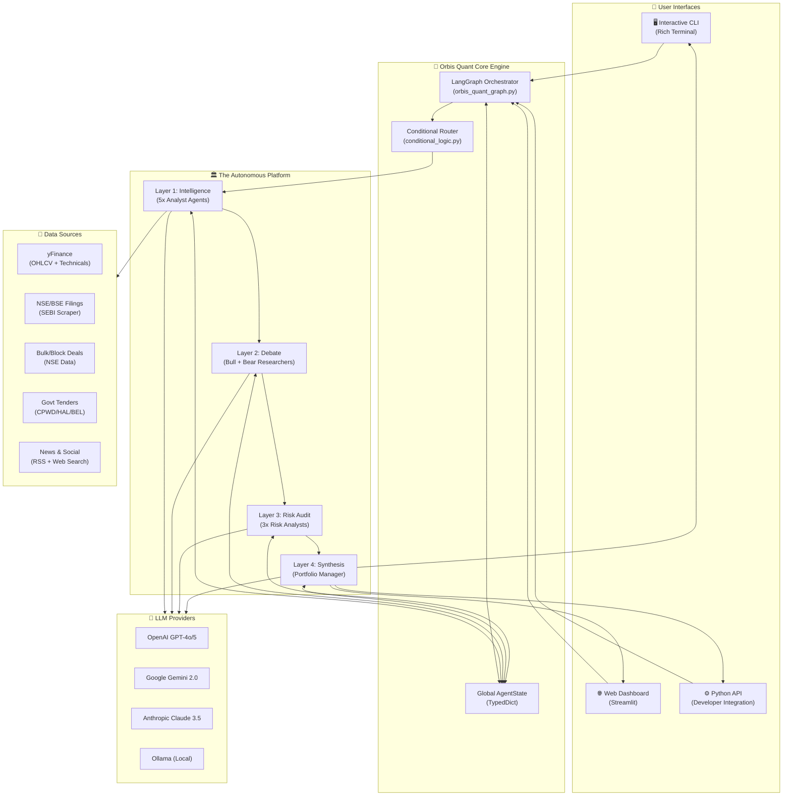
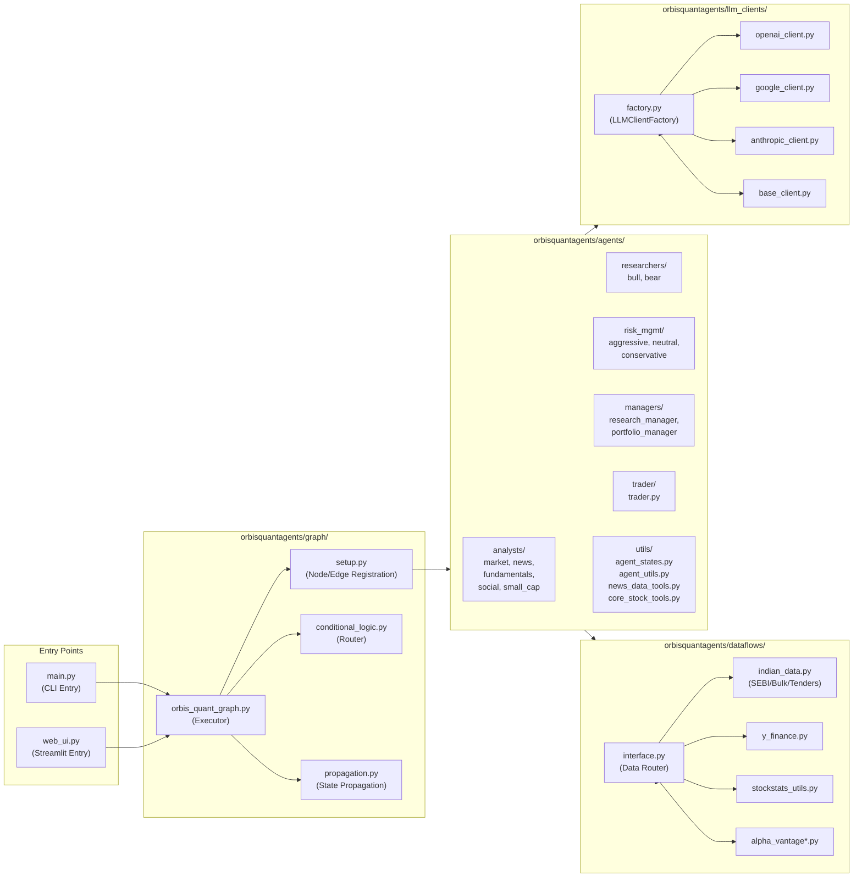
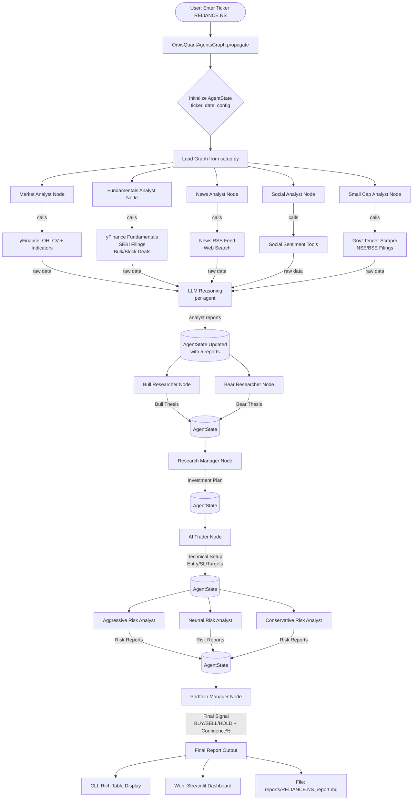
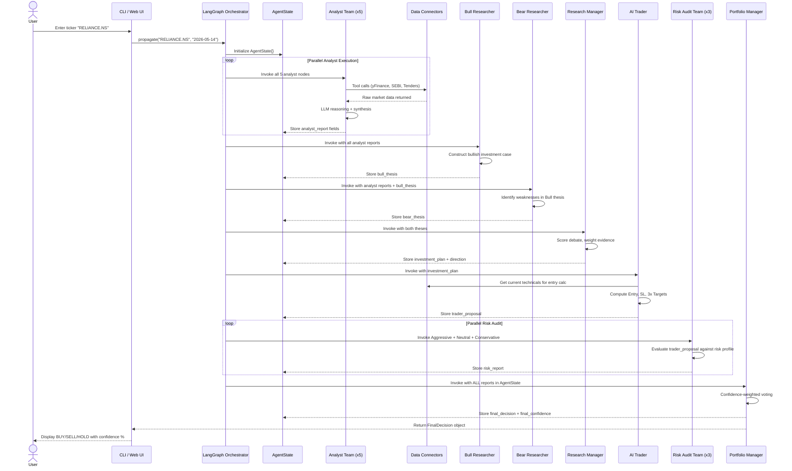
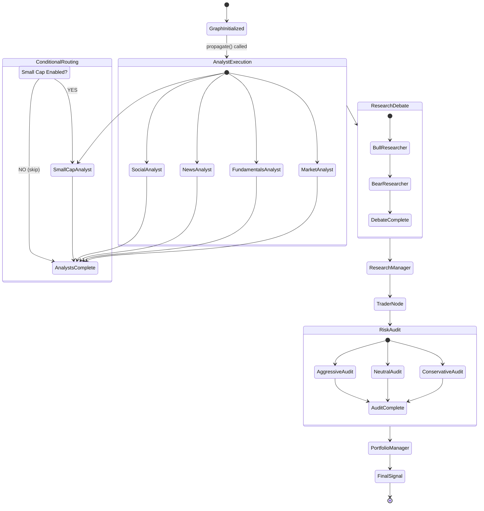
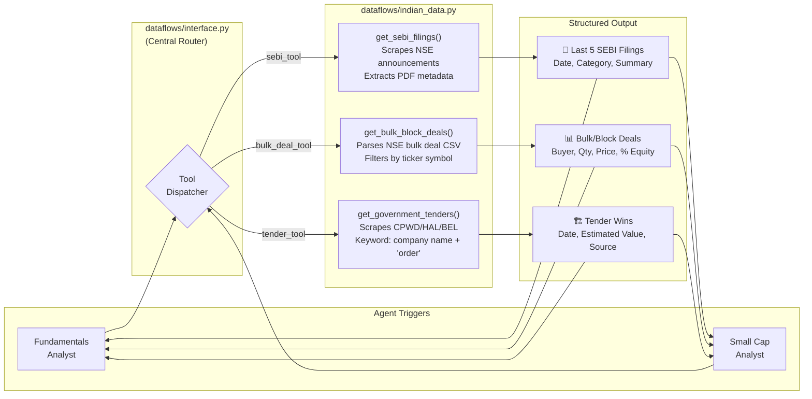
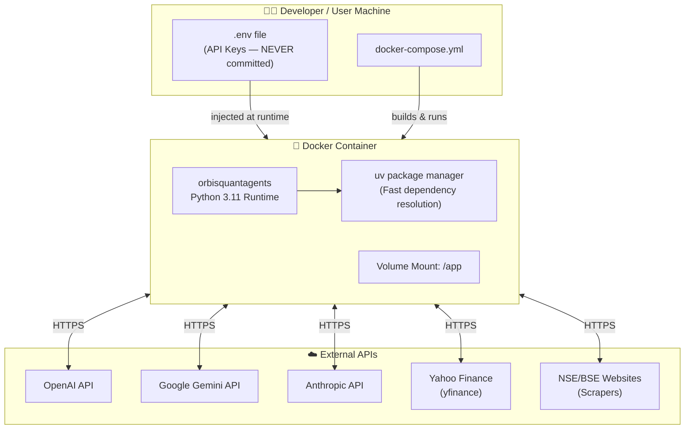
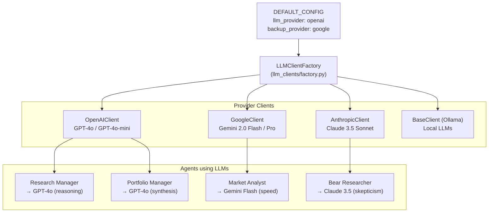
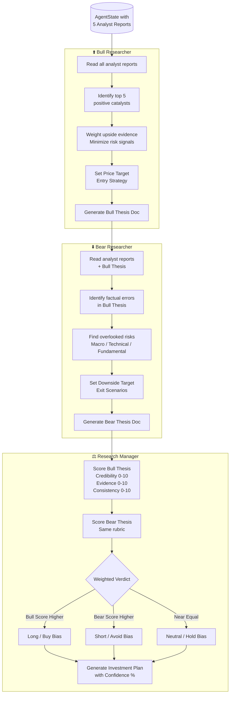
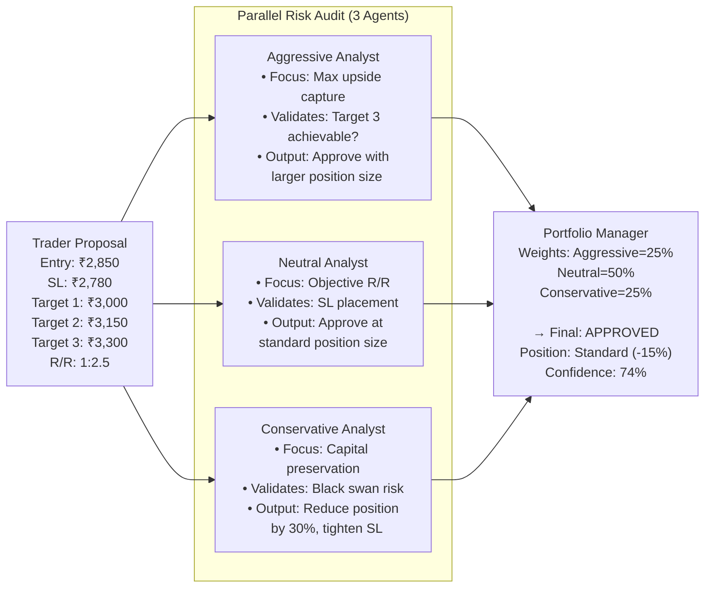

# ORBIS QUANT AGENTS — ARCHITECTURE DOCUMENT

```
━━━━━━━━━━━━━━━━━━━━━━━━━━━━━━━━━━━━━━━━━━━━━━━━━━━━━━━━━━━━━━
DOCUMENT     : System Architecture & Design Diagrams
VERSION      : 2.0 — Institutional Release
BRAND        : Orbis Quant AI
━━━━━━━━━━━━━━━━━━━━━━━━━━━━━━━━━━━━━━━━━━━━━━━━━━━━━━━━━━━━━━
```

---

## 1. High-Level Design (HLD)

The HLD illustrates the major system boundaries, external integrations, and how the User interacts with the platform at a 30,000-foot view.



---

## 2. Component Architecture Diagram

This shows the internal package structure and how modules depend on each other.



---

## 3. Data Flow Diagram (DFD) — Full Analysis Run

This traces exactly how data moves from user input to final report.



---

## 4. Agent Interaction Sequence Diagram

This shows the precise temporal ordering of agent calls.



---

## 5. State Machine Diagram (LangGraph Node States)

This shows the valid state transitions within the LangGraph execution.



---

## 6. Indian Data Connector — Architecture

This shows the specialized data pipeline for the Indian market.



---

## 7. Deployment Architecture Diagram

This shows how Orbis is deployed in a containerized production environment.



---

## 8. LLM Client Factory — Architecture

This shows how agents are assigned LLM providers dynamically.



---

## 9. Bull vs. Bear Debate Flow

This zooms into the adversarial reasoning mechanism.



---

## 10. Risk Audit Flow



---

*All diagrams are rendered using Mermaid.js and display natively on GitHub.*

```
━━━━━━━━━━━━━━━━━━━━━━━━━━━━━━━━━━━━━━━━━━━━━━━━━━━━━━━━━━━━━━
    ORBIS QUANT AI   |   github.com/AnupamaJain/orbis-quant-agents
    YouTube: @growthblueprint-ai   |   Instagram: @growthblueprintai
━━━━━━━━━━━━━━━━━━━━━━━━━━━━━━━━━━━━━━━━━━━━━━━━━━━━━━━━━━━━━━
```
