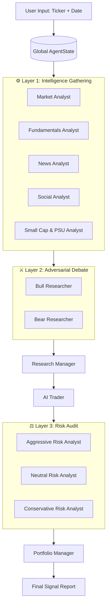

# ORBIS QUANT AGENTS
## Autonomous Multi-Agent Financial Intelligence Framework
### Product Requirements Document

```
━━━━━━━━━━━━━━━━━━━━━━━━━━━━━━━━━━━━━━━━━━━━━━━━━━━━━━━━━━━━━━
PROJECT      : Orbis Quant Agents
VERSION      : 2.0 — Institutional Release
STATUS       : Production-Ready / Public Release
DATE         : May 2026
PREPARED BY  : Orbis Quant AI Research Team
BRAND        : Orbis Quant AI — "The Autonomous Financial Firm"
━━━━━━━━━━━━━━━━━━━━━━━━━━━━━━━━━━━━━━━━━━━━━━━━━━━━━━━━━━━━━━
```

---

## SECTION 1: EXECUTIVE SUMMARY

### 1.1 Product Vision

**Orbis Quant Agents** is the world's first open-source, multi-agent autonomous financial intelligence framework purpose-built for the **Indian equity market (NSE/BSE)**. The product is designed to compress what traditionally requires an analyst team of five specialists working 8 hours into a single autonomous, adversarial, and risk-audited research report produced in under **5 minutes**.

Unlike conventional single-agent AI finance tools that produce biased, hallucinated outputs, Orbis mirrors the **internal structure of an institutional quantitative trading firm**. Every analysis involves multiple specialized agents that gather data, debate, cross-examine, and risk-audit each other's findings before a final signal is issued.

**The Core Bet**: The future of investment research is not a smarter chatbot. It is an autonomous, multi-agent firm where AI specialists check each other's work.

---

### 1.2 The Mission

> *"To give every Indian retail investor access to the same intelligence infrastructure that institutional hedge funds have spent millions building — for free, forever."*

---

### 1.3 Key Differentiators

| Feature | Orbis Quant Agents | Traditional AI Tools |
| :--- | :---: | :---: |
| Multi-Agent Adversarial Debate | ✅ | ❌ |
| Stateful LangGraph Orchestration | ✅ | ❌ |
| SEBI / NSE / BSE Filing Connectors | ✅ | ❌ |
| PSU & Small Cap "Deep Think" Mode | ✅ | ❌ |
| Bulk/Block Institutional Deal Tracker | ✅ | ❌ |
| Bull vs. Bear Mandatory Debate | ✅ | ❌ |
| Multi-LLM Support (GPT/Gemini/Claude) | ✅ | Partial |
| Premium Web Dashboard (Streamlit) | ✅ | ❌ |
| Dockerized Production Deployment | ✅ | ❌ |
| 100% Open Source | ✅ | ❌ |

---

## SECTION 2: PROBLEM STATEMENT

### 2.1 The Indian Retail Investor Gap

India has over **140 million retail demat accounts**, yet the vast majority of these investors operate with almost zero institutional-quality intelligence. The tools available to them fall into two inadequate categories:

1. **Expensive Bloomberg/Reuters Terminals** — Designed for institutions. Too costly and complex for retail.
2. **Generic AI Chatbots** — Can answer questions about stocks but lack real-time data, structured analysis workflows, and, critically, any mechanism to validate their own reasoning.

**The Result**: Retail investors in India are systematically outgunned by FIIs and HNIs who have proprietary research, faster data, and multi-analyst debate infrastructure.

### 2.2 The Single-Agent Reasoning Trap

Current-generation AI tools suffer from a fundamental architectural flaw: **they use a single LLM to both gather data and form a conclusion.** This creates three critical failure modes:

1. **Confirmation Bias**: The AI naturally gravitates toward information that confirms its initial "read" of a stock.
2. **Hallucination**: Without a second agent to cross-check, fabricated metrics go undetected.
3. **Overconfidence**: A single-agent system has no internal dissenting voice, leading to dangerously high conviction on fundamentally weak setups.

### 2.3 The PSU & Small-Cap Intelligence Void

India's Small Cap and Public Sector Undertaking (PSU) stocks represent some of the highest-volatility, highest-potential opportunities in the market. However, they require a very specific type of intelligence:

- Government **tender wins** (CPWD, NTPC, BEL, HAL portals)
- **Production-Linked Incentive (PLI) scheme** catalyst tracking
- **Defence order** announcement monitoring
- **Capex-cycle** positioning based on Union Budget signals

No existing AI tool provides this natively. Orbis was designed from the ground up to fill this exact gap.

---

## SECTION 3: TARGET USERS

### 3.1 Primary Persona: The Active Retail Trader

**Profile**: Tech-savvy individual investor, 25-45 years old, actively trades mid-cap and small-cap stocks on NSE.
**Pain**: Spends 2+ hours daily manually researching stocks, often basing decisions on Telegram "tips" rather than data.
**Goal**: A tool that can validate (or invalidate) a thesis in minutes.
**How Orbis Helps**: Runs a full 10-agent analysis in under 5 minutes, producing a structured report that catches the risks the trader may have missed.

### 3.2 Secondary Persona: The Quantitative Researcher

**Profile**: Data scientist or financial engineer building systematic trading strategies.
**Pain**: Integrating disparate data sources (fundamental, technical, sentiment) into a single Python workflow is time-consuming.
**Goal**: A modular, extensible framework they can build on top of.
**How Orbis Helps**: A clean Python API (`OrbisQuantAgentsGraph`) with a well-documented LangGraph state machine that is designed to be extended.

### 3.3 Tertiary Persona: The Risk Manager / Family Office

**Profile**: Manages a portfolio of ₹1Cr+, needs to audit large position entries.
**Pain**: No tool provides a structured "Devil's Advocate" challenge to an investment idea before deployment.
**Goal**: A risk-audit process that is systematic, repeatable, and documented.
**How Orbis Helps**: The 3-agent Risk Audit (Aggressive, Neutral, Conservative) provides the multi-perspective challenge that no single analyst can.

---

## SECTION 4: THE "FIRM" ARCHITECTURE — HOW ORBIS THINKS

### 4.1 The Core Philosophy

Orbis is built on a simple but powerful idea: **"No single perspective should ever be trusted."**

Every financial decision in the real world involves multiple specialists checking each other's work. A junior analyst finds a stock. A senior researcher stress-tests the thesis. A risk manager reviews the position size. The portfolio manager approves the final trade.

Orbis automates this entire workflow using an **adversarial multi-agent orchestration system** built on **LangGraph**.

### 4.2 The LangGraph State Machine

The backbone of the system is a **Stateful Directed Acyclic Graph (DAG)**:



**Key Design Properties**:
- **Stateful**: The `AgentState` object is passed through every node and accumulates all reports, debate transcripts, and risk scores.
- **Conditional Routing**: The `conditional_logic.py` module dynamically routes the graph based on analyst outputs (e.g., if the Small Cap analyst is not enabled, its node is skipped).
- **Parallelism**: Analyst nodes in Layer 1 can be run in parallel, reducing total wall-clock time.

---

## SECTION 5: AGENT SPECIFICATIONS (DEEP DIVE)

### 5.1 The Intelligence Layer (Analyst Agents)

#### 5.1.1 Market / Technical Analyst
- **Mission**: Analyze the price-action and quantitative signals of the target ticker.
- **Tools**: RSI, MACD, Bollinger Bands, SMA(20/50/200), EMA, Volume Profile, ATR.
- **Output**: A structured Markdown report identifying trend, momentum, key support/resistance levels, and a technical bias (Bullish/Bearish/Neutral).

#### 5.1.2 Fundamentals Analyst
- **Mission**: Evaluate the financial health of the company.
- **Tools**: P/E Ratio, EPS Growth, Revenue CAGR, D/E Ratio, Operating Margins, ROCE, SEBI Filing Connector, Bulk/Block Deal Tracker.
- **Indian Market Edge**: Natively understands the importance of **promoter holding trends** and **DII/FII activity** — two critical signals often ignored by US-centric tools.
- **Output**: A financial health scorecard covering profitability, leverage, and institutional interest.

#### 5.1.3 News & Macro Analyst
- **Mission**: Connect global macroeconomic events to specific ticker movements.
- **Tools**: RSS news feeds, web search, sector-specific sentiment scoring.
- **Indian Market Edge**: Tracks **RBI policy cycles** (repo rate decisions), **Union Budget sector allocations**, and **monsoon forecasts** for agricultural/FMCG stocks.
- **Output**: A news summary with macro risk factors and positive/negative catalysts ranked by impact.

#### 5.1.4 Social Sentiment Analyst
- **Mission**: Gauge retail sentiment from social channels to identify divergence from fundamentals.
- **Tools**: X (Twitter) search, Telegram mentions, StockTwits data.
- **Output**: A sentiment score (1-10) and key themes circulating in retail communities.

#### 5.1.5 Small Cap & PSU Analyst *(Indian Market Exclusive)*
- **Mission**: The "Deep Think" mode. This agent specializes in the intelligence that moves PSU and Small Cap stocks.
- **Tools**: Government tender portal scrapers, PLI scheme trackers, Defence ministry order monitors.
- **Output**: A "Catalyst Report" listing recent and potential upcoming order wins, government contract announcements, and infrastructure spend allocations.
- **Why it exists**: A PSU like **BEML, BEL, or IRCTC** may have strong fundamentals but the actual price trigger is almost always a government contract. This agent finds those triggers.

---

### 5.2 The Adversarial Layer (Research Team)

This is the most architecturally unique component of Orbis. It is the layer that separates it from every other AI finance tool.

#### 5.2.1 Bull Researcher
- **Mission**: Construct the strongest possible case for owning the stock.
- **Bias**: Instructed to weight positive catalysts, undervalue risks, and present the most optimistic-but-defensible price target.
- **Input**: All 5 analyst reports from Layer 1.
- **Output**: A "Bull Thesis" document with 3-5 key conviction points, price target, and entry strategy.

#### 5.2.2 Bear Researcher
- **Mission**: Destroy the Bull thesis. Find every possible reason the trade will fail.
- **Bias**: Instructed to focus on overvaluation, hidden risks, macro headwinds, and technical distribution patterns.
- **Input**: All 5 analyst reports from Layer 1 AND the Bull Thesis.
- **Output**: A "Bear Thesis" document with 3-5 key risk points, downside target, and exit scenario.

#### 5.2.3 The Debate Protocol
The Bull and Bear researchers engage in a structured debate loop:
1. **Round 1**: Bull presents thesis. Bear presents counter-argument.
2. **Round 2**: Bull defends against Bear's points. Bear identifies remaining weaknesses.
3. **Resolution**: Research Manager evaluates both sides and issues a weighted verdict.

**Why this matters**: In this debate, the Bear is specifically looking for factual errors, unsupported assumptions, and cherry-picked data in the Bull's report. This is effectively a built-in **hallucination checker**.

#### 5.2.4 Research Manager
- **Mission**: Act as the neutral judge of the debate.
- **Process**: Scores each researcher's argument on Credibility (0-10), Evidence Quality (0-10), and Internal Consistency (0-10).
- **Output**: A synthesized "Investment Plan" with a weighted conviction score and a recommended directional bias (Long/Short/Neutral).

---

### 5.3 The Execution Layer (Trader)

#### 5.3.1 AI Trader Agent
- **Mission**: Convert the abstract "Investment Plan" into a concrete technical setup.
- **Process**:
    1. Calls technical indicator tools to find the optimal entry price (e.g., awaiting a pullback to the 50-SMA or a breakout above resistance).
    2. Calculates a position-sized Stop-Loss based on the ATR.
    3. Sets 1R, 2R, and 3R price targets.
- **Output**: A "Trader Proposal" with Entry Price, Stop-Loss, three Targets, and a Risk/Reward ratio.

---

### 5.4 The Risk Audit Layer

#### 5.4.1 Aggressive Risk Analyst
- **Mission**: Find the maximum viable upside and argue for a larger position size.
- **Bias**: Focuses on momentum, recent sector strength, and undervalued catalysts.

#### 5.4.2 Conservative Risk Analyst
- **Mission**: Find every "Black Swan" scenario and argue for capital preservation.
- **Bias**: Focuses on liquidity risk, correlation to market drawdowns, and margin-of-safety violations.

#### 5.4.3 Neutral Risk Analyst
- **Mission**: Calculate the objective Risk/Reward and provide a balanced size recommendation.
- **Bias**: Pure quantitative assessment based on historical volatility and Sharpe implications.

---

### 5.5 The Synthesis Layer (Portfolio Manager)

The Portfolio Manager is the final, most senior agent in the "Firm."

**Decision Logic**:
1. Reads all reports: 5x Analyst, 2x Researcher, 1x Research Manager, 1x Trader, 3x Risk Auditors.
2. Applies a **Confidence-Weighted Voting** model.
3. Issues the final **BUY / HOLD / SELL** signal with a Confidence % (0-100%).
4. Generates a structured "Executive Summary" report with all supporting evidence.

---

## SECTION 6: SPECIALIZED INDIAN DATA CONNECTORS

### 6.1 SEBI Corporate Filing Tracker
- **Source**: NSE/BSE official announcement pages.
- **Fetch Logic**: Scrapes the latest PDF announcements for a given ticker.
- **Key Events Monitored**: Board meeting outcomes, Bonus/Split announcements, Director changes, Regulatory penalties, Auditor qualifications.
- **Format**: Returns last 5 announcements with date, category, and key text extracted.

### 6.2 Institutional Bulk & Block Deal Tracker
- **Source**: NSE Bulk Deal data.
- **Data Points**: Buyer/Seller name, Quantity traded, Price, % of total equity.
- **Significance**: A bulk deal by a known FII (e.g., CLSA, Morgan Stanley) is a powerful institutional vote of confidence.

### 6.3 Government Tender & PSU Order Tracker
- **Sources**: CPWD, HAL, BEL, IRCTC, NTPC, ONGC portal scrapers + news aggregation.
- **Logic**: Searches for the company name + "order" or "tender" or "contract" within the past 90 days.
- **Output**: A list of recent contract wins with approximate value if available.

---

## SECTION 7: DUAL-MODE INTERFACE

### 7.1 Premium Web Dashboard (Streamlit)

**Target User**: Analysts and casual investors who prefer a visual experience.

**Key Panels**:
1. **Ticker Input & Configuration**: Select ticker, date range, LLM provider, and analyst types.
2. **Live Agent Status**: Real-time progress bars showing which agent is currently running.
3. **Interactive Price Chart**: Plotly candlestick chart with SMA(20/50/200) and Volume overlays.
4. **The Debate Arena**: Side-by-side view of the Bull vs. Bear transcripts with confidence scores.
5. **Final Signal Card**: The Portfolio Manager's final decision rendered as a premium card with all key metrics.

### 7.2 Interactive CLI (Rich Terminal)

**Target User**: Power users, developers, and system-integration scenarios.

**Key Features**:
- Interactive setup wizard using the `questionary` library.
- Real-time agent status indicators with Unicode symbols.
- Tabular report views using `rich.table`.
- Output saved to `reports/` directory as structured Markdown.
- Full LangGraph debug trace mode via `--debug` flag.

---

## SECTION 8: MULTI-LLM ARCHITECTURE

Orbis is LLM-agnostic. It ships with a `LLMClientFactory` that supports:

| Provider | Models Supported | Best For |
| :--- | :--- | :--- |
| **OpenAI** | GPT-4o, GPT-4o-mini, GPT-5 | Research Manager, Portfolio Manager |
| **Google** | Gemini 1.5/2.0 Pro, Flash | High-speed Analyst runs |
| **Anthropic** | Claude 3.5/4 Sonnet, Opus | Adversarial Reasoning Agents |
| **Ollama** | Llama 3, Mistral, DeepSeek | 100% local / air-gapped deployments |

**Configuration**: Each agent can be assigned a different LLM via the config, allowing cost-optimized deployments (e.g., use Gemini Flash for cheap analyst runs, GPT-4o for the final Portfolio Manager decision).

---

## SECTION 9: TECHNICAL ARCHITECTURE

### 9.1 Project Structure
```
orbis-quant-agents/
│
├── orbisquantagents/
│   ├── agents/
│   │   ├── analysts/          # Layer 1: Specialist Analysts
│   │   ├── researchers/       # Layer 2: Bull & Bear Researchers
│   │   ├── risk_mgmt/         # Layer 3: Risk Audit Swarm
│   │   ├── managers/          # Research Manager & Portfolio Manager
│   │   ├── trader/            # AI Trader Agent
│   │   └── utils/             # AgentState, Tools, Memory
│   │
│   ├── dataflows/
│   │   ├── indian_data.py     # SEBI, Bulk Deal, Tender connectors
│   │   ├── y_finance.py       # yFinance wrapper
│   │   └── interface.py       # Unified data routing
│   │
│   ├── graph/
│   │   ├── orbis_quant_graph.py   # Main LangGraph executor
│   │   ├── setup.py               # Node + Edge registration
│   │   └── conditional_logic.py   # Dynamic routing logic
│   │
│   └── llm_clients/           # Multi-LLM factory & adapters
│
├── cli/                       # Rich terminal interface
├── web_ui.py                  # Streamlit dashboard
├── assets/                    # Brand images & schema diagrams
└── PRD.md                     # This document
```

### 9.2 State Management

The `AgentState` is a `TypedDict` that serves as the shared memory across all nodes:

```python
class AgentState(TypedDict):
    ticker: str
    date: str
    messages: List[BaseMessage]
    market_report: str
    fundamentals_report: str
    news_report: str
    social_report: str
    small_cap_report: str
    bull_thesis: str
    bear_thesis: str
    investment_plan: str
    trader_proposal: str
    risk_report: str
    final_decision: str
    final_confidence: float
```

### 9.3 Dependency & Environment Management

- **Package Manager**: `uv` (Ultra-fast Python package manager).
- **Runtime**: Python 3.11+.
- **Configuration**: `.env` file for all API keys (never committed to git).
- **Containerization**: Full `Dockerfile` and `docker-compose.yml` for production deployment.

---

## SECTION 10: DEPLOYMENT & OPERATIONS

### 10.1 Quick Start (Local)
```bash
# 1. Clone and install
git clone https://github.com/AnupamaJain/orbis-quant-agents.git
cd orbis-quant-agents
pip install .

# 2. Configure environment
cp .env.example .env
# Add your LLM API keys to .env

# 3. Launch (Web)
streamlit run web_ui.py

# 4. Launch (CLI)
python main.py
```

### 10.2 Docker Deployment
```bash
docker compose run --rm orbisquantagents
```

### 10.3 Python API
```python
from orbisquantagents.graph.orbis_quant_graph import OrbisQuantAgentsGraph
from orbisquantagents.default_config import DEFAULT_CONFIG

firm = OrbisQuantAgentsGraph(debug=True, config=DEFAULT_CONFIG.copy())
_, decision = firm.propagate("RELIANCE.NS", "2026-05-14")
print(f"Final Decision: {decision}")
```

---

## SECTION 11: ROADMAP

### Phase 1 (Current): Core Framework ✅
- Multi-agent LangGraph orchestration.
- Indian market connectors (SEBI, Bulk, Tenders).
- Premium CLI and Streamlit dashboard.

### Phase 2: Live Broker Integration (Q3 2026)
- Paper trading integration with **Dhan** and **Zerodha Kite** APIs.
- Auto-execution of BUY signals with configurable position sizing rules.

### Phase 3: Portfolio Intelligence (Q4 2026)
- Multi-stock portfolio analysis (analyze 10 stocks simultaneously).
- Sector rotation detection and macro-driven rebalancing suggestions.

### Phase 4: Hindi & Regional Language Support (2027)
- Final reports available in Hindi, Tamil, Telugu, and Bengali.
- Voice-output mode for accessibility.

### Phase 5: On-Chain & Alternative Data (2027)
- Integration of DeFi sentiment for stocks with crypto exposure.
- Satellite data feeds for commodity-linked sectors (agriculture, oil).

---

## SECTION 12: SUCCESS METRICS

| Metric | Definition | Target |
| :--- | :--- | :--- |
| **Time-to-Insight** | Time from ticker input to final report | < 5 minutes |
| **Hallucination Rate** | % of reports with factually incorrect data points | < 2% |
| **Bull/Bear Balance** | % of sessions where both sides are substantively represented | > 95% |
| **Indian Data Freshness** | Average age of SEBI filing data served | < 24 hours |
| **Conviction Accuracy** | % of High-Confidence (>70%) signals that were directionally correct at 1M | Benchmarked |

---

## SECTION 13: RISKS & MITIGATIONS

| Risk | Likelihood | Impact | Mitigation |
| :--- | :---: | :---: | :--- |
| NSE/BSE scraper breaks on site update | High | Medium | Fallback to yFinance + alert logging |
| LLM API rate limits during peak use | Medium | High | Multi-LLM fallback chain |
| Hallucinated financial metrics | Medium | High | Adversarial debate layer as cross-checker |
| Users mistaking reports for financial advice | High | High | Prominent disclaimer on all outputs |
| API key exposure in public forks | Medium | High | `.gitignore` + `.env.example` pattern enforced |

---

## SECTION 14: LEGAL & COMPLIANCE

> **DISCLAIMER**: All outputs from **Orbis Quant Agents** are for **research and educational purposes only**. They do not constitute financial advice, investment recommendations, or solicitation to buy or sell any security. Past analysis performance does not guarantee future results. The framework is provided "AS IS" without warranty of any kind.
>
> Users are solely responsible for their investment decisions. The Orbis Quant AI team is not liable for any financial losses incurred through the use of this framework.

---

## APPENDIX A: GLOSSARY

| Term | Definition |
| :--- | :--- |
| **AgentState** | The shared Python TypedDict that stores all reports and messages across the entire analysis run. |
| **LangGraph** | An open-source orchestration library for building stateful multi-agent applications. |
| **Adversarial Reasoning** | The architecture pattern where agents with opposing goals debate to surface bias and errors. |
| **SEBI** | Securities and Exchange Board of India — the primary market regulator. |
| **PSU** | Public Sector Undertaking — government-owned enterprises listed on NSE/BSE. |
| **Bulk Deal** | A single trade on an exchange involving more than 0.5% of a company's total equity. |
| **PLI Scheme** | Production-Linked Incentive — a Government of India program that subsidizes manufacturing in key sectors. |
| **Conviction Score** | A 0-100% composite score assigned by the Portfolio Manager based on the strength of the Bull vs. Bear debate outcome. |

---

```
━━━━━━━━━━━━━━━━━━━━━━━━━━━━━━━━━━━━━━━━━━━━━━━━━━━━━━━━━━━━━━
    ORBIS QUANT AI   |   github.com/AnupamaJain/orbis-quant-agents
    YouTube: @growthblueprint-ai   |   Instagram: @growthblueprintai
━━━━━━━━━━━━━━━━━━━━━━━━━━━━━━━━━━━━━━━━━━━━━━━━━━━━━━━━━━━━━━
```
