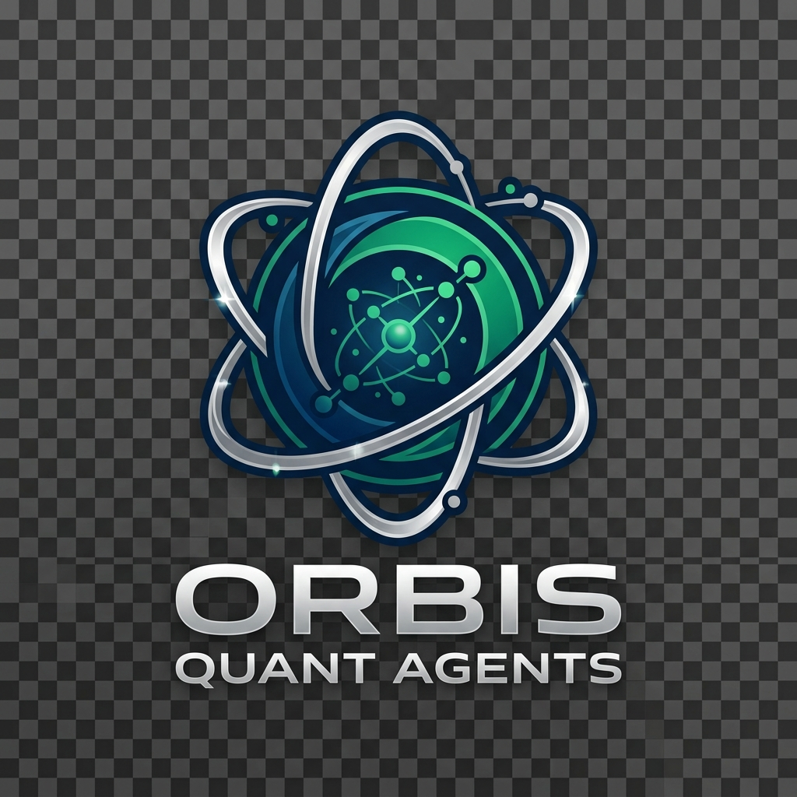

<p align="center">
  
</p>

<div align="center">
  <a href="https://arxiv.org/abs/2412.20138" target="_blank"></a>
  <a href="https://discord.com/invite/hk9PGKShPK" target="_blank"></a>
  <a href="https://x.com/OrbisQuantAI" target="_blank"></a>
  <a href="https://github.com/OrbisQuantAI/" target="_blank"></a>
</div>

<div align="center">
  🌐 
  <a href="https://www.readme-i18n.com/OrbisQuantAI/OrbisQuantAgents?lang=en">English</a> | 
  <a href="https://www.readme-i18n.com/OrbisQuantAI/OrbisQuantAgents?lang=de">Deutsch</a> | 
  <a href="https://www.readme-i18n.com/OrbisQuantAI/OrbisQuantAgents?lang=es">Español</a> | 
  <a href="https://www.readme-i18n.com/OrbisQuantAI/OrbisQuantAgents?lang=fr">Français</a> | 
  <a href="https://www.readme-i18n.com/OrbisQuantAI/OrbisQuantAgents?lang=ja">日本語</a> | 
  <a href="https://www.readme-i18n.com/OrbisQuantAI/OrbisQuantAgents?lang=zh">中文</a>
</div>

---

# 🌌 Orbis Quant Agents
### *The Autonomous Multi-Agent Financial Intelligence Framework*

**Orbis Quant Agents** is a state-of-the-art financial analysis framework that mirrors the structure of a professional quantitative trading firm. Unlike traditional single-agent systems, Orbis orchestrates a specialized "team" of LLM-powered agents that debate, cross-reference, and validate market data to deliver high-conviction trading intelligence.

---

## ⚡ What Makes Orbis Different?

The framework is built around a **"Firm" Architecture**, where specialized agents (Analysts, Researchers, Traders) collaborate to deliver high-conviction investment strategies.

### 🌐 Stunning Web Dashboard
In addition to the powerful CLI, Orbis Quant Agents now features a **premium Streamlit-based web interface**:
- **Real-time Intelligence Feed**: Watch as agents gather data and analyze tickers in real-time.
- **Interactive Visualization**: High-performance Plotly charts with technical indicators (SMA, Volume).
- **The Debate Arena**: Side-by-side view of the Bull vs. Bear strategy debate.
- **Agent Progress Tracking**: Visual status indicators for every agent in the "Firm".

### 🇮🇳 Indian Market Optimized
- **Deep-domain awareness**: Optimized for **NSE/BSE** stocks, including automated tracking of RBI policies, Union Budgets, and regional sentiment.
- **🤖 Multi-LLM Native**: Fluidly switch between **GPT-4o/5**, **Claude 3.5/4**, **Gemini 1.5/3**, and local models via **Ollama**.
- **📈 Comprehensive Intelligence**: Integrates technical indicators, fundamental data, news sentiment, and social media trends into a unified report.

---

## 🏗️ Inside the Strategy Lab

Our framework decomposes the complex task of trading into specialized nodes within a **LangGraph** orchestration:

### 1. The Intelligence Core (Analyst Team)
*   **Fundamentals Analyst**: Dissects balance sheets, cash flows, and income statements.
*   **Sentiment Analyst**: Scours X (Twitter), Telegram, and specialized forums for retail mood.
*   **News Analyst**: Connects global macro events to specific ticker movements.
*   **Technical Analyst**: Maps price action using RSI, MACD, Bollinger Bands, and more.

### 2. The Strategy Lab (Researcher Team)
Two specialized researchers—one **Bullish** and one **Bearish**—critically evaluate the analysts' findings. They engage in a structured debate to find the truth between the hype and the risks.

### 3. The Execution Desk (Trader & PM)
*   **The Trader**: Synthesizes the debate into a concrete transaction proposal.
*   **Portfolio Manager**: The final gatekeeper. Reviews risk levels, sizing, and the investment thesis before issuing a final **BUY / HOLD / SELL** decision.

---

## 🚀 Quick Start

### Installation

```bash
# Clone the repository
git clone https://github.com/OrbisQuantAI/OrbisQuantAgents.git
cd OrbisQuantAgents

# Set up your environment
python -m venv .venv
source .venv/bin/activate  # Or use conda

# Install dependencies
pip install .
```

### Configuration
Rename `.env.example` to `.env` and add your preferred API keys:
```env
OPENAI_API_KEY=your_key
GOOGLE_API_KEY=your_key
ANTHROPIC_API_KEY=your_key
```

### 🖥️ Usage

#### 1. Web Dashboard (Recommended)
Launch the premium web interface:
```bash
streamlit run web_ui.py
```

#### 2. Command Line Interface
Launch the interactive CLI:
```bash
python main.py
```

---

## 📦 Integration & Usage

### Python API
Initialize the "Firm" directly in your own scripts:

```python
from orbisquantagents.graph.orbis_quant_graph import OrbisQuantAgentsGraph
from orbisquantagents.default_config import DEFAULT_CONFIG

# Initialize with default settings
firm = OrbisQuantAgentsGraph(debug=True, config=DEFAULT_CONFIG.copy())

# Analyze an Indian stock
_, decision = firm.propagate("RELIANCE.NS", "2026-05-12")
print(f"Final Decision: {decision}")
```

### Docker Support
Run the entire stack in a containerized environment:
```bash
docker compose run --rm orbisquantagents
```

---

## 🤝 Contributing & Research

We are building the future of decentralized financial AI. Whether you are a quant, an AI researcher, or a developer, we welcome your contributions.

Join the community: [Orbis Quant AI](https://orbisquant.ai/)

## 📄 Citation

If you use Orbis Quant Agents in your research, please cite us:

```bibtex
@misc{orbisquant2025,
      title={Orbis Quant Agents: Multi-Agents LLM Financial Trading Framework}, 
      author={Orbis Quant AI Research Team},
      year={2025},
      url={https://github.com/OrbisQuantAI/OrbisQuantAgents}, 
}
```

---
<p align="center">
  <i>Disclaimer: This framework is for research and educational purposes only. It is not financial advice.</i>
</p>
