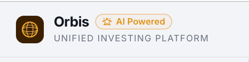
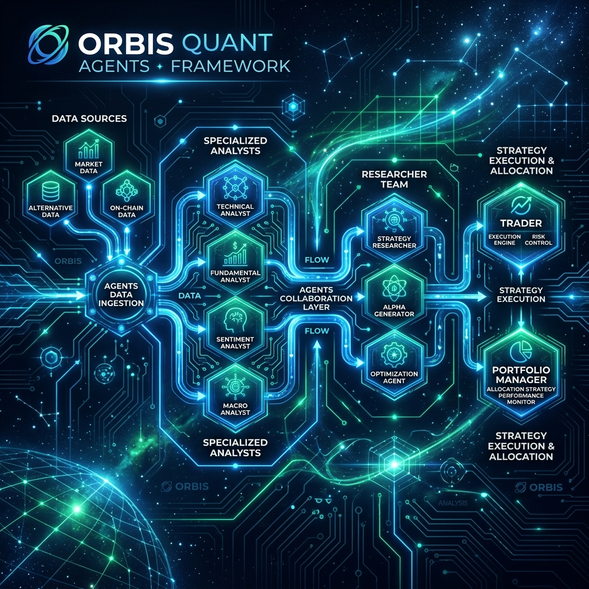
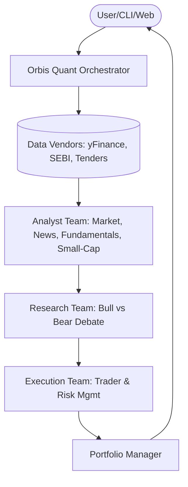
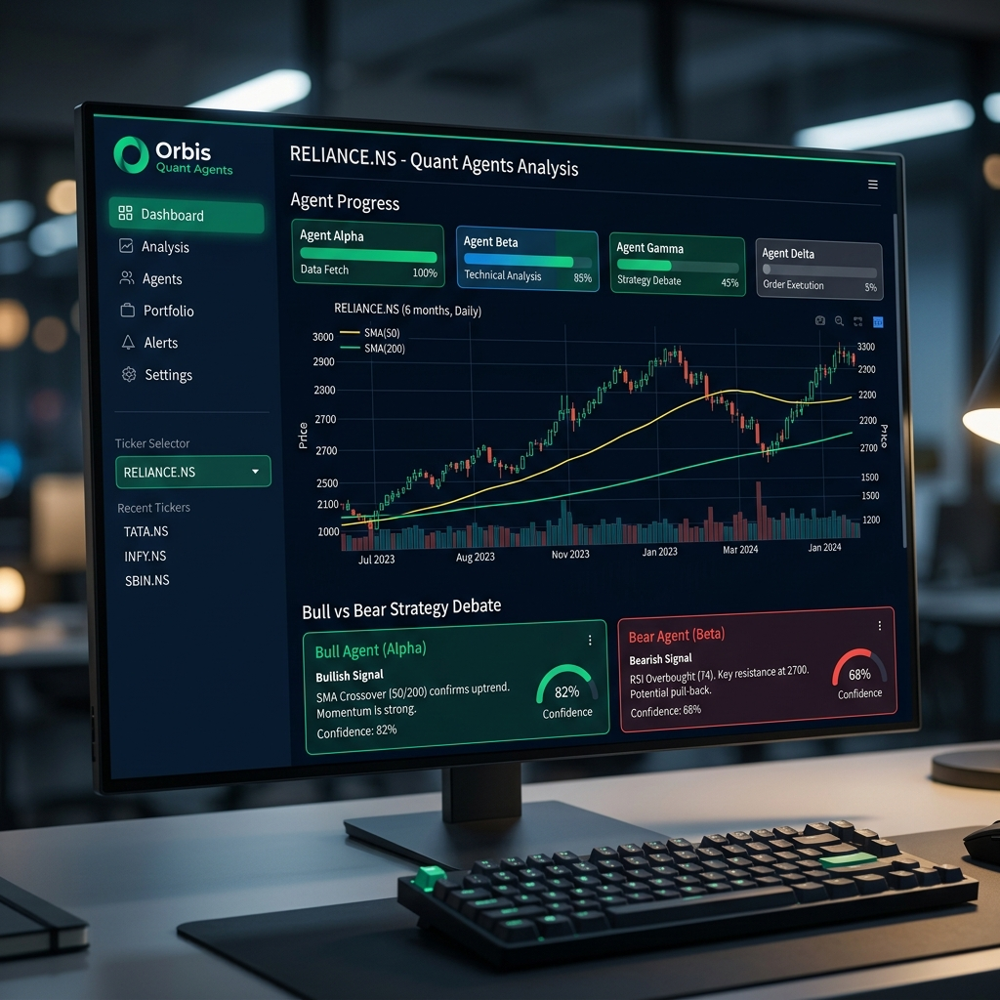
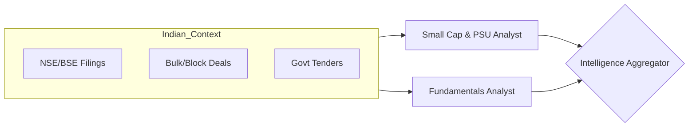
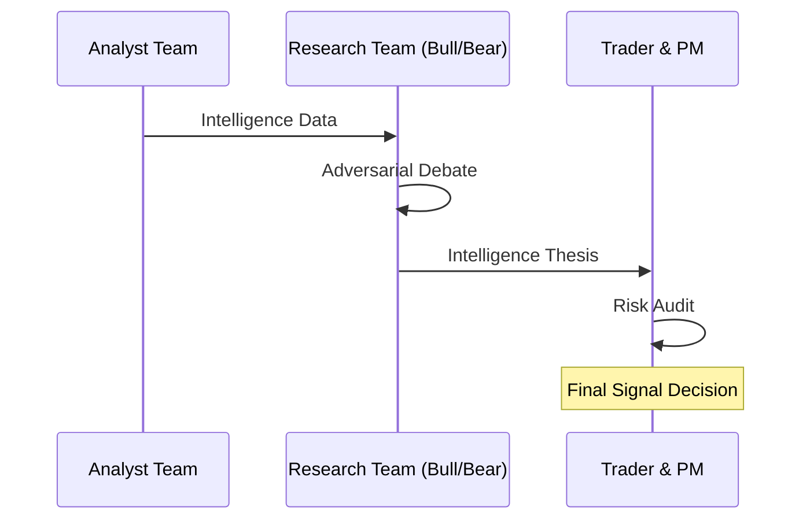
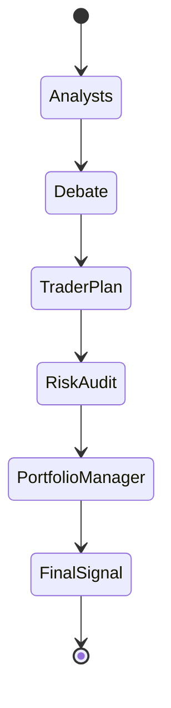

<p align="center">
  
</p>
<div align="center">
  <a href="https://youtube.com/@growthblueprint-ai" target="_blank"></a>
  <a href="https://www.instagram.com/growthblueprintai/" target="_blank"></a>
</div>

---

# 🌌 Orbis Quant Agents
### *The Autonomous Multi-Agent Financial Intelligence Framework*

**Orbis Quant Agents** is a state-of-the-art financial analysis framework that mirrors the structure of a professional quantitative trading firm. Unlike traditional single-agent systems, Orbis orchestrates a specialized "team" of LLM-powered agents that debate, cross-reference, and validate market data to deliver high-conviction trading intelligence.



---

## ⚡ What Makes Orbis Different?

Here's a sharp breakdown of Orbis Quant Agents' USPs and how it differs from just prompting Claude directly.

The core distinction: **Orbis is an architecture, not a prompt.** Asking Claude *"analyse RELIANCE.NS"* gives you one model's best guess. Orbis runs 10+ specialized agents that challenge, verify, and overrule each other — the same stock gets both a bull and a bear case from agents explicitly instructed to disagree.

The fundamental difference is **trust, not intelligence**. When you ask Claude to analyse a stock, you get one model's best attempt — and there's nothing stopping it from confidently presenting a wrong P/E ratio or missing a key risk. Orbis fixes this architecturally: the Bear Researcher's whole job is to find what the Bull got wrong.

### 🏆 The Six USPs (in order of importance)

1. **Structural Hallucination Detection**: The Bull vs. Bear debate loop isn't just for balance. The Bear agent is explicitly scanning the Bull's report for fabricated metrics and unsupported claims. This is the most meaningful thing Orbis does that a prompt cannot.
2. **Real-Time Data**: Claude's knowledge has a cutoff. Orbis pulls live price data, recent SEBI filings, and current bulk deal activity. The difference between *"Reliance has strong fundamentals"* and *"DII bought ₹420Cr of Reliance stock yesterday"* is what drives actual decisions.
3. **India-Specific Intelligence**: No other AI tool connects PSU stock analysis to government contract portals. A BEML or BEL investor needs to know about tender wins, not just the balance sheet. This is Orbis's clearest moat.
4. **An Audit Trail, Not a Chat Message**: Every agent's output is stored in `AgentState`. You can read the Bear's counter-arguments even when the PM issues a BUY. With Claude directly, that reasoning is invisible.
5. **Cost-Optimised Multi-Model Routing**: You can run the cheap, fast tasks on Gemini Flash and save Claude Sonnet/Opus only for the Portfolio Manager synthesis. Prompting Claude directly means paying full price for every token including the routine data-gathering steps.
6. **An Actionable Trade Setup**: Orbis outputs Entry Price, Stop-Loss, and R-multiples. Claude gives you a thesis. These are different things — one you can act on, one you have to interpret further.

---

The framework is built around a **"Firm" Architecture**, where specialized agents (Analysts, Researchers, Traders) collaborate to deliver high-conviction investment strategies.



### 🌐 Stunning Web Dashboard
In addition to the powerful CLI, Orbis Quant Agents now features a **premium Streamlit-based web interface**:



- **Real-time Intelligence Feed**: Watch as agents gather data and analyze tickers in real-time.
- **Interactive Visualization**: High-performance Plotly charts with technical indicators (SMA, Volume).
- **The Debate Arena**: Side-by-side view of the Bull vs. Bear strategy debate.
- **Agent Progress Tracking**: Visual status indicators for every agent in the "Firm".

### 🇮🇳 Indian Market Optimized
- **Deep-domain awareness**: Optimized for **NSE/BSE** stocks, including automated tracking of RBI policies, Union Budgets, and regional sentiment.


- **🤖 Multi-LLM Native**: Fluidly switch between **GPT-4o/5**, **Claude 3.5/4**, **Gemini 1.5/3**, and local models via **Ollama**.
- **📈 Comprehensive Intelligence**: Integrates technical indicators, fundamental data, news sentiment, and social media trends into a unified report.

---

## 🏗️ Inside the Strategy Lab

Our framework decomposes the complex task of trading into specialized nodes within a **LangGraph** orchestration:

### 1. The Intelligence Core (Analyst Team)
*   **Fundamentals Analyst**: Dissects balance sheets, cash flows, and income statements.
*   **Sentiment Analyst**: Scours X (Twitter), Telegram, and specialized forums for retail mood.
*   **News Analyst**: Connects global macro events to specific ticker movements.
*   **Technical Analyst**: Maps price action using RSI, MACD, Bollinger Bands, and more.

### 2. The Strategy Lab (Researcher Team)
Two specialized researchers—one **Bullish** and one **Bearish**—critically evaluate the analysts' findings. They engage in a structured debate to find the truth between the hype and the risks.

### 3. The Execution Desk (Trader & PM)
*   **The Trader**: Synthesizes the debate into a concrete transaction proposal.
*   **Portfolio Manager**: The final gatekeeper. Reviews risk levels, sizing, and the investment thesis before issuing a final **BUY / HOLD / SELL** decision.



#### Technical State Schema
The underlying **LangGraph** engine manages a stateful transaction flow:



---

## 🚀 Quick Start

### Installation

```bash
# Clone the repository
git clone https://github.com/OrbisQuantAI/OrbisQuantAgents.git
cd OrbisQuantAgents

# Set up your environment
python -m venv .venv
source .venv/bin/activate  # Or use conda

# Install dependencies
pip install .
```

### Configuration
Rename `.env.example` to `.env` and add your preferred API keys:
```env
OPENAI_API_KEY=your_key
GOOGLE_API_KEY=your_key
ANTHROPIC_API_KEY=your_key
```

### 🖥️ Usage

#### 1. Web Dashboard (Recommended)
Launch the premium web interface:
```bash
streamlit run web_ui.py
```

*Note: If running behind a cloud container, VM, or proxy and you encounter a blank page or connection errors, launch with CORS and XSRF disabled:*
```bash
streamlit run web_ui.py --server.headless true --server.enableCORS false --server.enableXsrfProtection false
```

#### 2. Command Line Interface
Launch the interactive CLI:
```bash
python main.py
```

---

## 📦 Integration & Usage

### Python API
Initialize the "Firm" directly in your own scripts:

```python
from orbisquantagents.graph.orbis_quant_graph import OrbisQuantAgentsGraph
from orbisquantagents.default_config import DEFAULT_CONFIG

# Initialize with default settings
firm = OrbisQuantAgentsGraph(debug=True, config=DEFAULT_CONFIG.copy())

# Analyze an Indian stock
_, decision = firm.propagate("RELIANCE.NS", "2026-05-12")
print(f"Final Decision: {decision}")
```

### Docker Support
Run the entire stack in a containerized environment:
```bash
docker compose run --rm orbisquantagents
```

---

## 🤝 Join the Community

Learn about finance & investing, psychology and how to build rule based system:

- **YouTube**: [🔗 Growth Blueprint AI](https://youtube.com/@growthblueprint-ai) - Deep dives into fundamental & technical research.
- **Instagram**: [📸 @growthblueprintai](https://www.instagram.com/growthblueprintai/) - Market psychology.
- **Discord**: [💬 Orbis Quant AI](https://discord.com/invite/hk9PGKShPK) - Technical support and research debate (coming soon).


---
<p align="center">
  <i>Disclaimer: This framework is for research and educational purposes only. It is not financial advice.</i>
</p>
